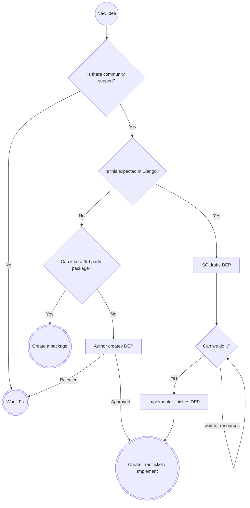

# Django Features

## TODOs

- Write up overview in English
- Move the mermaid chart to the proper location
- Write up descriptions of each phase
- Write up instructions for SC / Feature Review team for each phase
- Generate URLs for various queues for people to bookmark
- Write up instructions for expedited DEP process

## Here to create a new idea?

## Have an idea for Django?

Please know, things in Django take a while. You will need to be patient.

Please start with reviewing the new feature process in Django.

Next, go create an issue in this repository.

## Want to help steer Django?

Review the open tickets in this queue. Please share support on this via emojis.

Please know that we have specific meanings for emojis:

- 👍 This is something I would use
- 👎 This is something that would cause problems for me or Django
- 😕 I’m indifferent to this
- 🎉 This is an easy win

If you have extra information that is in favor or against an idea, please add it in a comment.

### Things not to do

Please avoid doing the following:

- Writing comments that are "+1" or "-1". Use emojis to share those opinions, please.
- Writing comments that are "What's the state of this?" You can see which phase of the process the idea is in by looking at the labels

## Do you have feedback about the process?

Please share your opinions on the [Forum](https://forum.djangoproject.com/c/internals/5).

