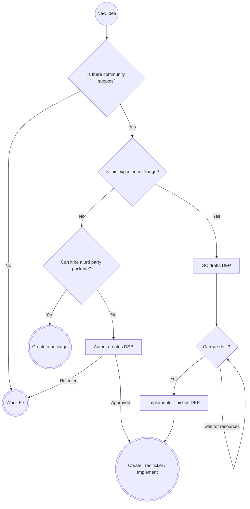

# Django Features

This is an example of a repository that contains the new feature ideas for
the Django web framework. This repository is for display purposes only and
should not be used.

## Have an idea for Django?

Please know, things in Django take a while. You will need to be patient.

Please start with reviewing the [new feature process in Django](#djangos-new-feature-process).

Next, go [create an issue in this repository](https://github.com/tim-schilling/new-features/issues/new).

## Want to help steer Django?

There are three queues that need community involvement:

- [Is there community support?](https://github.com/tim-schilling/new-features/issues?q=is%3Aissue%20state%3Aopen%20label%3A%22phase%20%2F%20is%20there%20community%20support%22)
  - Review the open tickets in this queue. Please share support on this via emojis.
  - Please follow the [Emoji Reaction guide](#emoji-reaction-guide)
  - See [Is there community support?](#is-there-community-support) for more details
- [Is a feature expected in Django core?](https://github.com/tim-schilling/new-features/issues?q=is%3Aissue%20state%3Aopen%20label%3A%22phase%20%2F%20is%20this%20expected%20in%20core%22)
  - Weigh-in on whether a feature should exist in Django core
  - See [Is this expected in Django?](#is-this-expected-in-django) for more details
- [Needing volunteers to implement or implementation review](https://github.com/tim-schilling/new-features/issues?q=is%3Aissue%20state%3Aopen%20label%3A%22phase%20%2F%20needs%20community%20DEP%22)
  - Help implement or design features
  - See [Can we do it?](#can-we-do-it) for more details

### Leaving comments

The community is encouraged to engage in discussion about a feature idea. Please try to
avoid one-on-one discussions here though when possible. Long threads are difficult to
follow and require a person to summarize periodically.

### Things not to do

Please avoid doing the following:

- Writing comments that are "+1" or "-1". Use emojis to share those opinions, please.
- Writing comments that are "What's the state of this?" You can see which phase of the process the idea is in by looking at the labels

## Django's new feature process

This repository is used to contain Django's new feature process. The
purpose is to identify features that the community deems helpful and
necessary to exist within Django.

The high level flow of the process can be seen in the chart below:

### Is there community support?

The initial phase of every feature is understanding if there's community
support for an idea. Community members should express their opinion in
two ways:

- An emoji reaction for simple opinions
- A written comment for detailed support or criticism

#### Emoji reaction guide

Using the following emojis on an issue has the related meaning.

- 👍 This is something I would use
- 👎 This is something that would cause problems for me or Django
- 😕 I’m indifferent to this
- 🎉 This is an easy win

#### Raising awareness

If you've created a feature request and want to bring more attention to it,
you should consider some of the following:

- Post about it on Social Media with the #Django hashtag
- Post about it on the [Django Forum](https://forum.djangoproject.com/)
- Write a blog post
- Create a video
- Give a conference talk

The larger your idea, the more investment you may need to make to convince
the community to support it.

#### How is community support determined?

The [Steering Council](https://docs.djangoproject.com/en/dev/internals/organization/#steering-council)
will review issues periodically. They will review
a subset of issues in this category and determine whether there's community
support for an idea. This is to the Steering Council's discretion.

### Is this expected in Django?

The phase after there's community support is the phase to determine if the
feature idea is expected in Django core. Community members are encouraged to
voice their opinion on why something is or is not expected in Django.

#### How are features determined to be within Django?

The Steering Council will review issues periodically. They will review a
subset of issues in this category and weigh the perspectives of the
community and determine whether a feature should be added to Django.
This is to the Steering Council's discretion.

### Can we do it?

The phase after it's agreed upon that the feature belongs in Django is
determining whether the feature can be implemented. Advancing beyond this
phase requires a [DEP](#expedited-dep-process) to be created.
The [Steering Council](https://docs.djangoproject.com/en/dev/internals/organization/#steering-council) or a community
member can create the first draft. It should contain everything but the
technical details of implementation (unless those are known already).
The community needs a person or a group of people to volunteer to implement
the feature.

For smaller issues, several steps of the DEP process can be skipped as
they will already have occurred.

For larger issues, the DEP process should be followed, more closely.
This is because the actual implementation of the feature will need
to be agreed upon before any code can be merged.

#### How do we determine if we can do it?

When there is a DEP that the Steering Council is in agreement upon which
has everything but perhaps the last of the technical details, a Trac
ticket can be created and implementation Pull Requests to Django can
be sent.

This does not mean work can't start beforehand, but we shouldn't ask for
Fellow's involvement until these things are completed.

### Can the feature be a third-party package?

The phase when it's determined that a feature has community support, but
shouldn't be in Django core is determining whether the feature should be a
third-party package. Most features should strive to be third-party packages.
This approach allows for faster iteration and more variability in our
ecosystem. 

It's possible that a feature can't be a third-party package due to the nature
of the feature or limitations of Django. In this case, the DEP process should
be followed. This [DEP](#expedited-dep-process) must be written by
a community member rather than the [Steering Council](https://docs.djangoproject.com/en/dev/internals/organization/#steering-council).

## Expedited DEP process

This new feature process has overlap with the existing [DEP process](https://github.com/django/deps/).
This allows us to expedite the DEP process depending on the size of the feature
 according to the table below. It's still important to use DEPs to identify
the rationale, motivation and considerations of features. We're all shepherds
of Django, and we owe it to future maintainers to explain why we choose to add things.

| Feature Size                                                                                                                                   | Days to Weeks                                                                                             | Months                                                                                                                                                  | Quarters                                                                                                                                                |
|------------------------------------------------------------------------------------------------------------------------------------------------|-----------------------------------------------------------------------------------------------------------|---------------------------------------------------------------------------------------------------------------------------------------------------------|---------------------------------------------------------------------------------------------------------------------------------------------------------|
| [Pre-posal](https://github.com/django/deps/blob/main/final/0001-dep-process.rst#pre-proposal)                                                  | Completed in [Is there community support](#is-there-community-support)                                    | Completed in [Is there community support](#is-there-community-support)                                                                                  | Completed in [Is there community support](#is-there-community-support)                                                                                  |
| [Forming the team](https://github.com/django/deps/blob/main/final/0001-dep-process.rst#forming-the-team)                                       | Author: Steering Council. Implementation team: Feature proposer or community member Shepherd: N/A | Author: Steering Council. Implementation team: Feature proposer or community member Shepherd: Community member, Fellow, Steering Council member | Author: Steering Council. Implementation team: Feature proposer or community member Shepherd: Community member, Fellow, Steering Council member |
| [Submitting the draft](https://github.com/django/deps/blob/main/final/0001-dep-process.rst#submitting-the-draft)                               | No forum discussion, just create draft Pull Request                                                       | No forum discussion, just create draft Pull Request                                                                                                     | Follow DEP process                                                                                                                                      |
| [Discussion, development, and updates](https://github.com/django/deps/blob/main/final/0001-dep-process.rst#discussion-development-and-updates) | N/A unless the Steering Council pushes it back                                                            | N/A unless the Steering Council pushes it back                                                                                                          | Follow DEP process                                                                                                                                      |
| [Review & Resolution](https://github.com/django/deps/blob/main/final/0001-dep-process.rst#review-resolution)                                   | Follow DEP process                                                                                        | Follow DEP process                                                                                                                                      | Follow DEP process                                                                                                                                      |
| [Implementation](https://github.com/django/deps/blob/main/final/0001-dep-process.rst#implementation)                                           | Follow DEP process                                                                                        | Follow DEP process                                                                                                                                      | Follow DEP process                                                                                                                                      |

The Steering Council can draft DEPs on behalf of the community because when an idea passes
through [Is this expected in Django?](#is-this-expected-in-django), the following sections
will have been discussed and determined:

- Title
- Preamble
- Abstract
- Motivation
- Rationale
- Copyright

The remaining three sections will need to be written by a community member,
likely the person or group of people who will be implementing the feature.

- Specification
- Backwards Compatibility
- Reference Implementation

## Do you have feedback about the process?

Please share your opinions on the [Forum](https://forum.djangoproject.com/c/internals/5).

## Steering Council guidance

There are several tasks that the Steering Council should take to
maintain the backlog of ideas. Not every idea must be reviewed at
every interval, but some ideas should constantly be moving forward.

### Triaging new ideas

- [Queue to review](https://github.com/tim-schilling/new-features/issues?q=is%3Aissue%20state%3Aopen%20(no%3Alabel%20OR%20label%3A%22phase%20%2F%20new%22))
- Any relevant labels should be applied to the issue 
- If the issue is a duplicate of another, it should be closed and referred to the original
- The concerns of triaging are:
  - Clarity of the proposal
  - Label usage
  - Duplicates

### Determining consensus on community support

- [Queue to review](https://github.com/tim-schilling/new-features/issues?q=is%3Aissue%20state%3Aopen%20label%3A%22phase%20%2F%20is%20there%20community%20support%22%20)
- The issues should be reviewed to determine if the community has arrived at consensus
  - The question here is, “Does the community think this change is good for Django?”
  - People who expressed significant disagreement may be asked to explain their disagreement
  - When reviewing the issue, ignore the following as it’s irrelevant to this stage of the process
    - It’s really hard to do
    - We don’t have the capacity to implement this
  - Potential results
    - Nothing, because community discussion is ongoing or more is needed
    - Consensus on yes, remove the "Is there community support" label and add "Is this expected in Django" label
    - Consensus on no, the issue is closed
  - The discussion and decision should be summarized into a single post by the team
  - Next steps need to be communicated

### Determining is this expected in Django

- [Queue to review](https://github.com/tim-schilling/new-features/issues?q=is%3Aissue%20state%3Aopen%20label%3A%22phase%20%2F%20is%20this%20expected%20in%20core%22)
- The issue should be reviewed to determine if the idea is expected to be in Django
  - Features that should be merged into core Django are:
    - Proven to be integral to Django a significant number of applications
    - The design or need of the feature going to be stable for years
  - When reviewing the issue, ignore the following as it’s irrelevant to this stage of the process
    - It’s really hard to do
    - We don’t have the capacity to implement this
    - Feasibility of making it a third-party app
       - The changes to support an easier integration should be proposed separately
  - Potential results
    - Nothing, because community discussion is ongoing or more is needed
    - Consensus on yes, remove the "Is this expected in Django" label and add "needs SC DEP" label
    - Consensus on no, the issue is closed or remove "Is this expected in Django" label and add "third-party package" label
  - The discussion and decision should be summarized into a single post by the team
  - Next steps need to be communicated

### Creating DEPs for expected features

- [Queue to review](https://github.com/tim-schilling/new-features/issues?q=is%3Aissue%20state%3Aopen%20label%3A%22phase%20%2F%20needs%20SC%20DEP%22)
- The issue should have a DEP created at 
  - It should contain the following sections:
    - Title
    - Preamble
    - Abstract
    - Motivation
    - Rationale
    - Copyright
  - The technical detail sections can be left for the community member who implements the feature
  - When the Steering Council agrees on the above sections:
    1. Remove "needs SC DEP" label and add "needs community DEP"
    2. Add links/references between DEP draft and the feature idea issue
