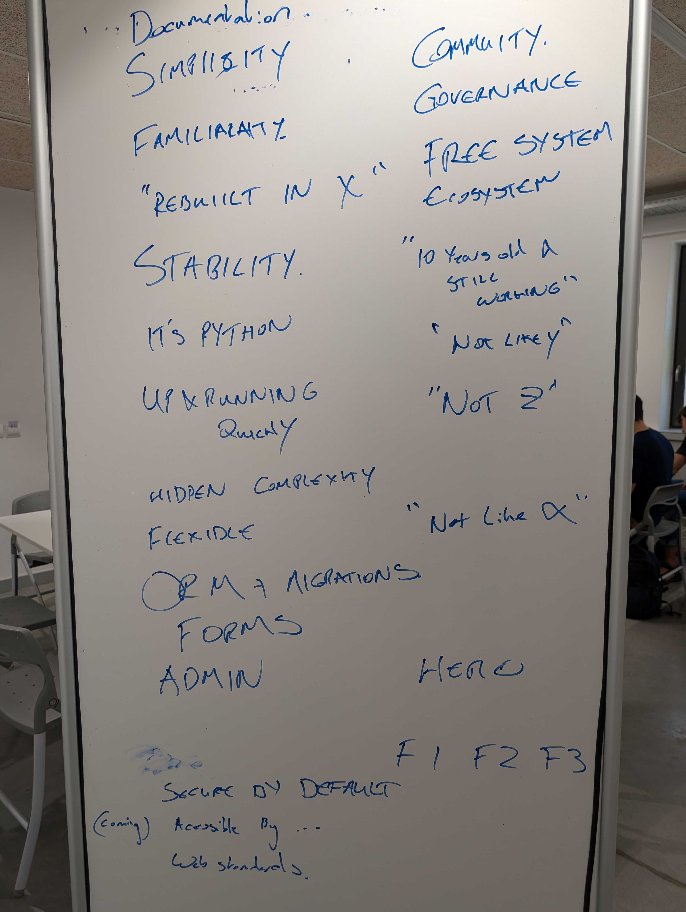
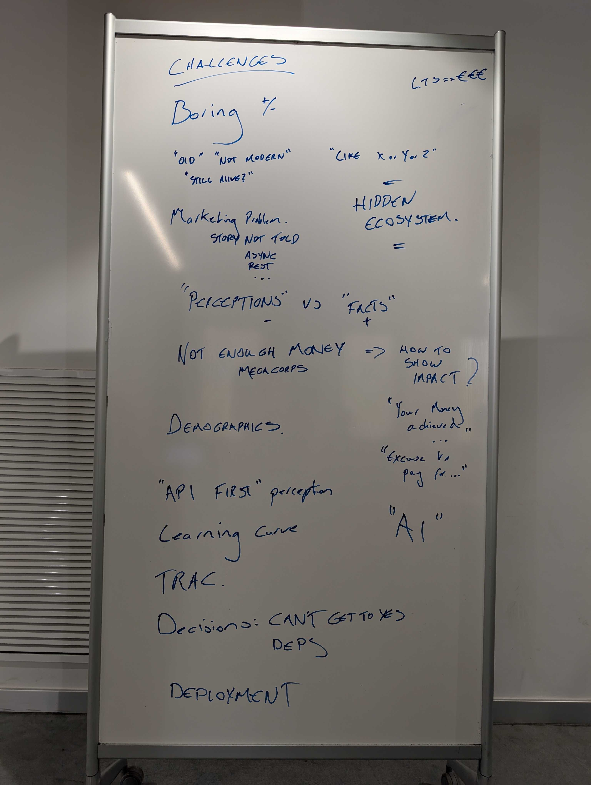
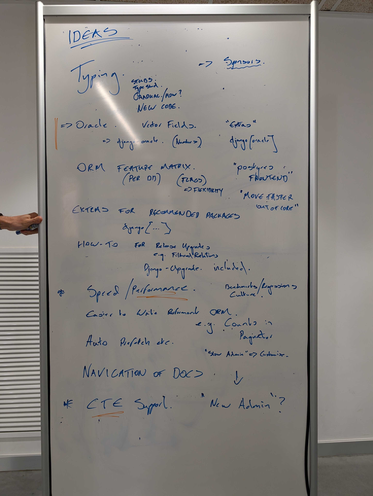
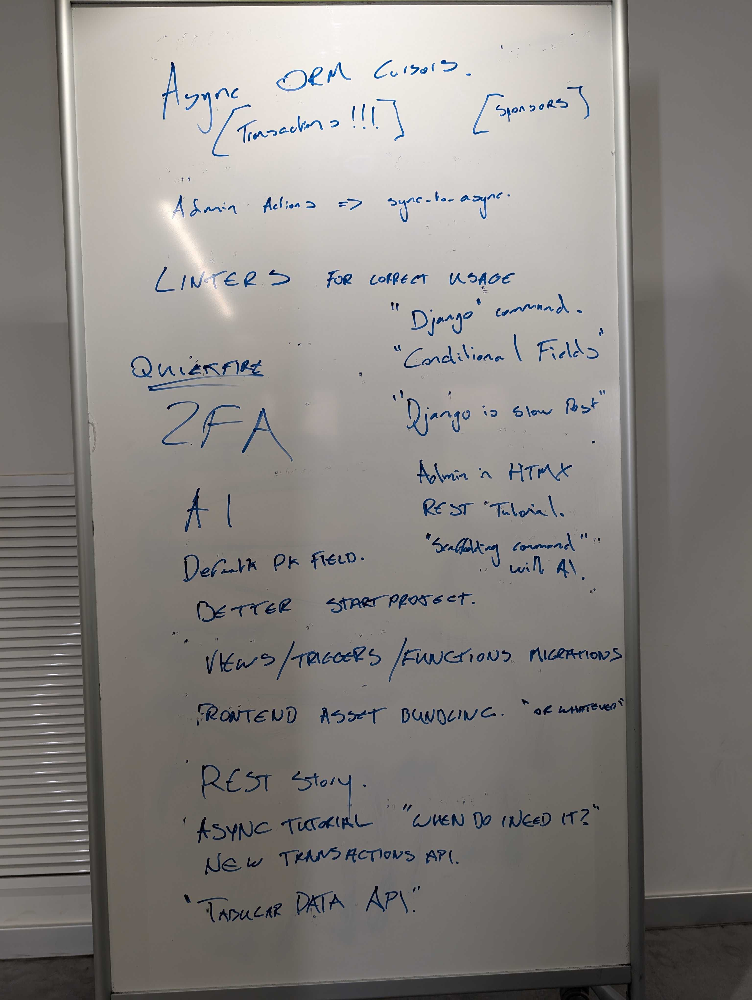

# Hosting an In-Person New Features Review

An in-person review of the Django [new features](https://code.djangoproject.com/query?status=new&type=New+feature&col=id&col=summary&col=status&col=owner&col=type&col=version&col=has_patch&order=priority) can be a productive way to surface shared priorities, clarify issues, and advance their state. The format is flexible and can be adapted to the group.

## What is helpful

- A large screen so everyone can follow the same issues and discussions
- A whiteboard and markers for open brainstorming
- A shared document for capturing outcomes

## A structure that has worked

### 1. Opening brainstorm (optional)

A low-structure opening session can work well as an icebreaker, especially when not everyone knows each other. A facilitator invites stream-of-thought ideas — pain points, improvements, feature wishes — while clustering related ideas on a whiteboard. No strict objective needed. This can lead to small groups forming around shared topics, which can carry into later discussion.

### 2. Feature walkthrough

A facilitator pulls up the backlog on the projector and the group works through tickets together. It can help to start with a few items already on people's minds before opening up to a broader, interest-driven selection. The shared screen keeps discussion focused and concrete — connecting earlier ideas to real proposals, clarifying misunderstandings, and surfacing what already exists.

As the backlog grows, finding the most valuable tickets to discuss may require more deliberate curation beforehand.

### 3. Wrap-up and synthesis (optional)

A short closing session using a shared document can help consolidate what emerged — what was discussed, what remains open, and where people might continue contributing. This makes progress visible and gives attendees a clearer sense of next steps.

## Past sessions

Below you can find summaries of past sessions, their takeaways and advice for the future.

### October 2025, Django on the Med

Paolo Melchiorre, one of the Django on the Med organizers [wrote a full retrospective of the event here](https://www.paulox.net/2025/12/30/django-on-the-med-a-contributor-sprint-retrospective/).

#### Part 1 — Opening brainstorm

We started with a very open, low-structure session facilitated by Carlton using a simple whiteboard and marker. Everyone shared stream-of-thought ideas about pain points, improvements, and feature wishes in Django. There was no strict objective, which made it a great icebreaker, especially since not everyone knew each other. Carlton clustered the inputs live on the board, grouping related ideas. With around 14 people, it worked really well and naturally led to small groups forming around shared topics. A quiet room with minimal distractions helped a lot.

The session produced four whiteboards:

**Django's qualities** — what participants valued about the framework, including simplicity, stability, familiarity, "up and running quickly", hidden complexity as a feature, the ORM, migrations, forms, admin, and being secure by default. Community and governance were also noted, as well as web standards accessibility (coming).

**Challenges** — perceived weaknesses and external pressures, including a "boring" reputation, being seen as "old" or "not modern", a marketing problem (the Django story not being told well, especially around async and REST), the hidden ecosystem, funding gaps, demographics, the "API first" perception, learning curve, AI, difficulty getting decisions to yes, and deployment.

**Ideas (part 1)** — feature and improvement ideas including typing support (stubs, type shed), Oracle and vector field support, an ORM feature matrix per database, extras for recommended packages (`django[...]`), upgrade how-tos, speed and performance benchmarks, easier performant ORM patterns (counts, pagination, auto-prefetch), admin customisation, docs navigation, and CTE support.

**Ideas (part 2)** — further ideas including async ORM cursors and transactions, migrating admin actions to async, linters for correct Django usage, a `django` command, conditional fields, 2FA, a default PK field, a better `startproject`, views/triggers/functions in migrations, frontend asset bundling, a REST story, an async tutorial, a new transactions API, and a tabular data API.

#### Part 2 — Feature review with projector

The second moment was closer to what you’re probably referring to. Lily led a walkthrough of feature ideas and where proposals live, using a projector so everyone could follow the same tickets and discussions. It was informal but very useful to connect the earlier brainstorm topics with real proposals, clarify misunderstandings, and align on what already exists. Having everyone gathered around the same screen made the discussion focused and concrete.

#### Part 3 — Wrap-up and synthesis

Later, Daniele guided a short synthesis session using a shared document to consolidate what had emerged from the discussions and topic groups. That helped make progress visible, clarify what was still open, and give people a clearer sense of where they could continue contributing.

